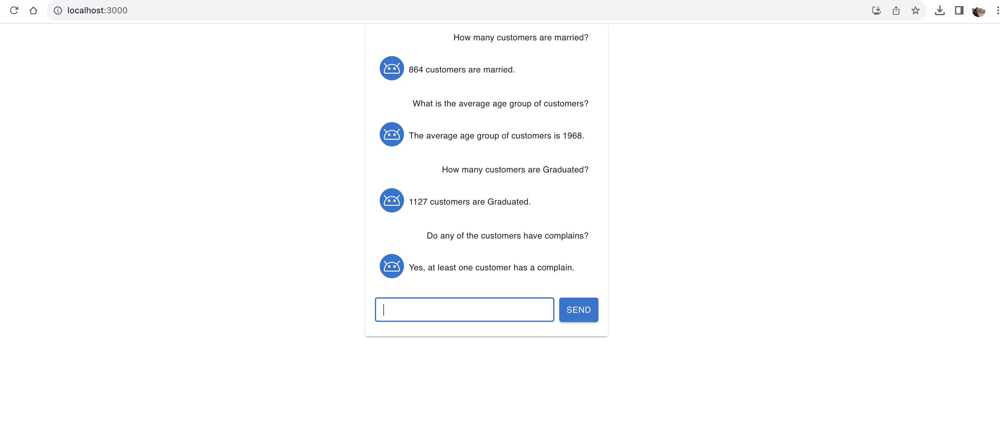
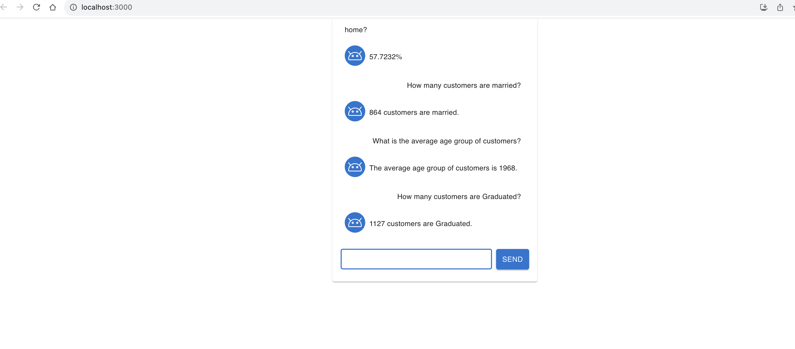
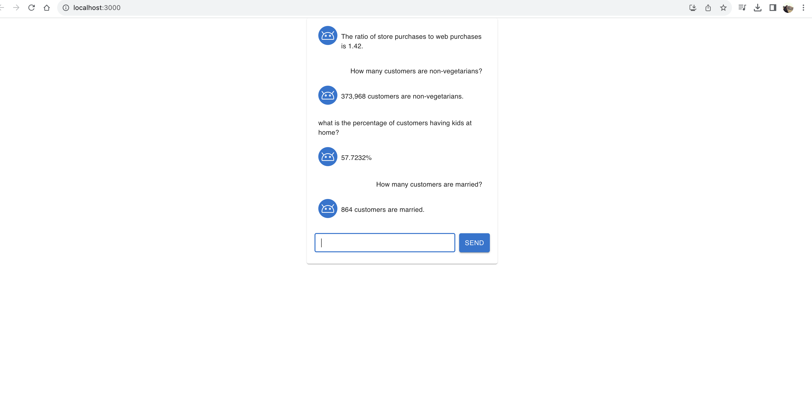

# Generative AI Chatbot

This is an AI chatbot using generative AI solutions that can answer any question on the following dataset:
Dataset: https://github.com/nailson/ifood-data-business-analyst-test/blob/master/ml_project1_data.csv
Dictionary: https://github.com/nailson/ifood-data-business-analyst-test/blob/master/dictionary.png

## Requirements

```
  Node v20.8.0
  npm 10.1.0
  python 3.10.10
  React js ^18.2.0
```

## Getting Started

To install dependecies in React js application run the command:

```bash
npm install
```

To install dependecies in Python application run the command:

```bash
pip install langchain openai chromadb tiktoken
pip install pandas
pip install flask
```

To start your web server for python, run the following command in your project directory:

```bash
python3.10 app.py
```
or
```bash
python app.py
```

To start your web server for react local development, run the following command in your chatbot-app folder:

```bash
npm start
```

Now that the development server is running, you can open a browser and preview your app:

-   Go to http://localhost:3000/

## Images






